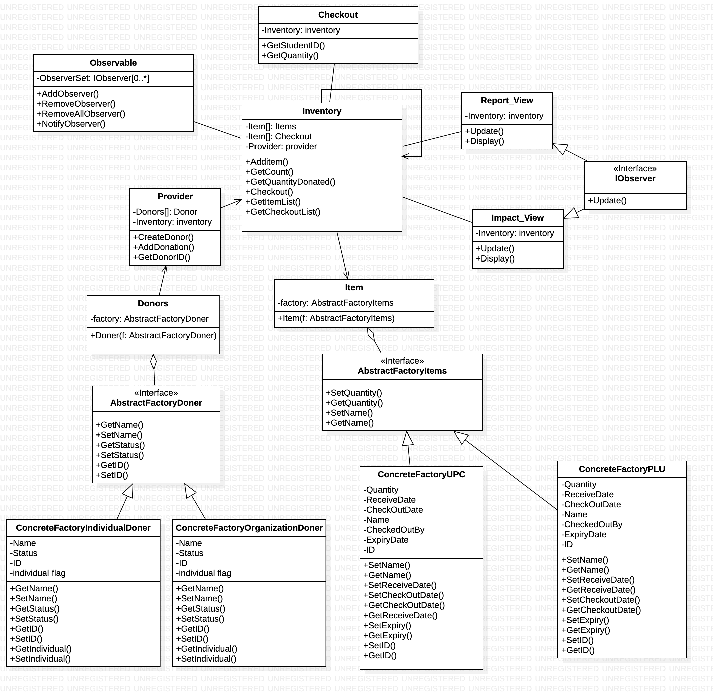
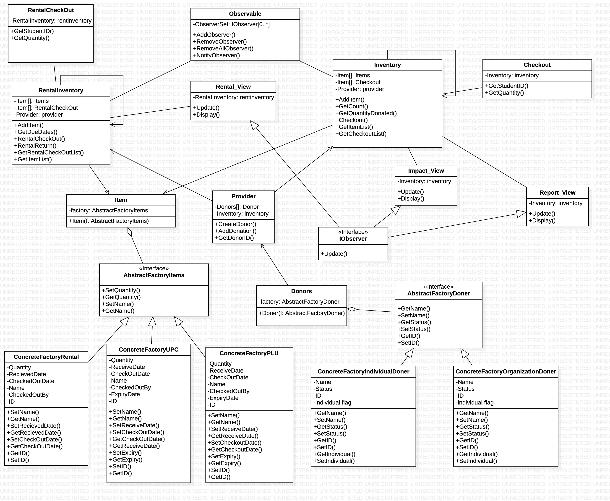

# Food Pantry [](https://travis-ci.org/ChicoState/PantryDjango)

Welcome to the Food Pantry open source project!

Chico State, like many other universities, has a food pantry for students who do not have access to enough to eat. The pantry provides food for students for free by storing donated and wholesale purchased bulk foods. We want to create a system to manage the inventory of a food pantry, as well as generate reports about the pantry's activities. We need to design a website that manages the information.

## Code of Conduct

Code of conduct for this project is given in 
[Code of Conduct](Code_of_Conduct.md).

## Initial Contributors

Initial contributors are noted in [Contributors](Contributors.md)

## Licensing

This project is licensed following the MIT licene given in
[License](LICENSE).

## Requirements

Softwares and technologies used in this project are mentioned in [Requirements](requirements.txt)

## Before UML diagram



### UML Diagram Description

We used 2 Abstract factory design patterns. Also we used one singleton design pattern for the inventoy along with Observer design pattern for views. The details of the classes in the UML diagram are as follows.

## After UML diagram (added appliance rental)





# Starting the web server


You need to be in the directory that contains the manage.py file (the PantryDjango directory). In the console, we can start the web server by running python manage.py runserver: 


command-line
```
(myvenv) ~/DjangoPantry$ python manage.py runserver
```

If you are on a Chromebook, use this command instead:

Cloud 9
```
(myvenv) ~/DjangoPantry$ python manage.py runserver 0.0.0.0:8080
```

If you are on Windows and this fails with UnicodeDecodeError, use this command instead:

command-line
```
(myvenv) ~/DjangoPantry$ python manage.py runserver 0:8000
```

Now you need to check that your website is running. Open your browser (Firefox, Chrome, Safari, Internet Explorer or whatever you use) and enter this address:

browser
```
http://127.0.0.1:8000/
```

# Static Analysis Tool

We used Django Lint as our static analysis tool that checks projects and applications that use the Django web development framework.
It reports on common programming errors and bad code smells, including checking for nullable CharField field types, the use of deprecated Django features (such as auto_now_add) as well as the absence of recommended options in settings.py. It aims to encourage the development of high-quality re-usable Django applications.Django Lint is currently implemented as a wrapper around PyLint.
The official documentation and download of django Lint can be found [here](https://pypi.org/project/django-lint/)

# Travis CI Continous Integration Status 

[](https://travis-ci.org/ChicoState/PantryDjango)

# Acknowledgments & Inspiration

Software Design and Maintenance Professor and Instructor [Dr.Kevin Buffardi,PHD](https://www.csuchico.edu/csci/people/faculty/buffardi-kevin.shtml)

* [GitHub](https://github.com/kbuffardi)
* [GoogleScholar](https://scholar.google.com/citations?user=KmIt5HIAAAAJ&hl=en)
* [Twitter](https://twitter.com/drkevinbuffardi?lang=en)
* [LinkedIn](https://www.linkedin.com/in/kevin-buffardi-5a84351/)
